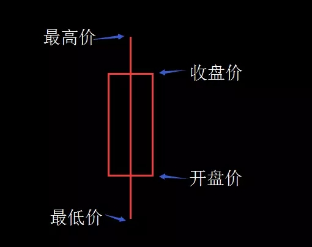
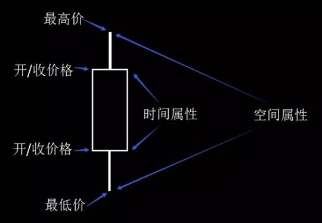

股票价格走势由K线构成，人们经常提到的走势图就是指k线图。K线图中的每一根k线都有四个最重要的价位，分别是开盘价、收盘价、最高价、最低价。开盘价和收盘价代表时间跨度，最高价和最低价代表空间跨度。

 首先看本段的第一句话：“股票价格走势由K线构成，人们经常提到的走势图就是指k线图。”

不要以为这些都是废话就略过去了，联线理论的这四节，是我用了几年时间一句句的斟酌出来的，整套理论，是我有生以来的全部心血，每一句话，都是经过严密思考得来的。

通过这一句话，我们知道了股票价格的单位是k线，而k线又组成走势图。联线理论的全篇就是围绕k线走势图展开论述的。

下面我开始对单只k线的结构进行描述了：“K线图中的每一根k线都有四个最重要的价位，分别是开盘价、收盘价、最高价、最低价。”

 

 

可能你又觉得废话了，“谁不知道一根k线中有这四个价格？”。是的，大家伙都知道，苹果熟了不摘会落到地上也是尽人皆知的事情。可是你想过没有，为什么牛顿提出苹果落地就是全人类的进步，而其他人即使生得比牛顿早，更早提出苹果、梨子、桃子熟了都会落到地上，却不能被人称为天才？

 

原因就在于你提出的这套理论能否被逻辑证明，如果不能，那只能是一种感知。牛顿牛的地方，在于能通过逻辑证明出苹果落地因为有引力。虽然现在看起来稀松平常，但这在当时是开创性的，通过万有引力定理，从而也能证明出为什么月亮要围着地球转，地球围着太阳转，它们的运行轨道是什么等一系列科学难题。

 

再回到走势，一根k线的四个价格，这是所有k线走势图中最基础也是最最重要的部分，我们所有对k线的分析一定要建立在正确的基础观上不偏离。

 

那这一只k线的四个价格有什么重要属性吗？接着向下看：“开盘价和收盘价代表时间跨度，最高价和最低价代表空间跨度。”

 

这里提到了时间和空间的概念，时间和空间属性产生在了同一根k线的不同位置，表现出了时空不可分割性。因为单只k线在k线走势图中不可再分，所以单只k线中的时空关系也是最基础的关系，无法在所对应的走势层级中进行再分。

 

 

在时空属性关系中，空间属性在单只k线中占据了最大轮廓位置，而时间属性在空间属性内的位置又是不固定的——开盘价和收盘价一定无法超越最高价和最低价，相反，最高价和最低价一定是反映单只k线运动范围的价格。

 

通过以上规律我们可以看出，单只k线的空间属性最适合对走势的空间进行分析，也就是我们平时讲到的涨多少或跌多少的问题。同时，我们一定不要忘了，时空的不可分割性，这在以后讲到时间问题时不至于失去分析依照。